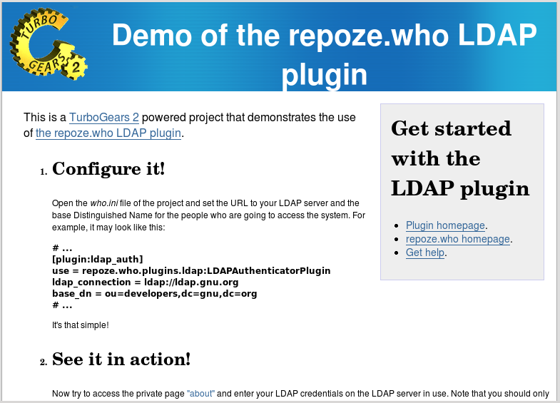
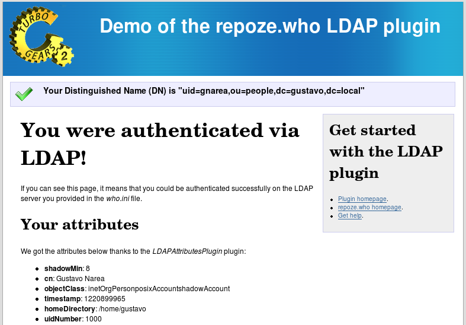

=======================
Trying the demo project
=======================

`repoze.who.plugins.ldap` ships with a working `TurboGears 2
<http://turbogears.org/2.0/>`_ project powered by this `repoze.who` plugin. It
enables you to give it a try with your own LDAP server.

Getting the source
==================

This demo is included the the *demo/* subfolder of the project. If you installed
the plugin directly, you may `get its source from the PYPI
<http://pypi.python.org/pypi/repoze.who.plugins.ldap/>`_.

You may also get the latest source code from its Bazaar branch::

    bzr branch lp:repoze.who.plugins.ldap

Installing the project
======================

The project is powered by TurboGears 2, so you should `install it
<http://www.turbogears.org/2.0/docs/main/DownloadInstall.html>`_ first.

Once you've installed TurboGears, you will be ready to install the demo::

    cd demo
    python setup.py develop

Configuring the demo
====================

Open the `who.ini` file and set your LDAP URL and your base Distinguished Name,
both found in the `[plugin:ldap_auth]` section.

For example,

::

    [plugin:ldap_auth]
    use = repoze.who.plugins.ldap:LDAPAuthenticatorPlugin
    ldap_connection = ldap://localhost
    base_dn = ou=people,dc=localhost

Running the application
=======================

You can run the application from the *demo/* folder::

    paster serve development.ini

Then go to http://localhost:8080/ to use it!

Trying to authenticate via LDAP
===============================

Now go to the "private" section http://localhost:8080/about and login with your
credentials in the LDAP server you're using.

If you entered them correctly, you'll access the page!

How it works
============

This demo configures `repoze.who` via an INI file (`who.ini`), which is loaded
in `demo/ldapauth/config/middleware.py`.

Then the login form is triggered when you try to access a private page as
anonymous, as in the `about` action controller (found at
`ldapauth.controllers.root:RootController`)::

    # ...
    def about(self):
        if request.environ.get('repoze.who.identity') == None:
            raise HTTPUnauthorized()
    # ...

Once the user has been authenticated, you'll be able to access her DN with the
code below, for example::

    from pylons import request
    dn = request.environ['repoze.who.identity']['repoze.who.userid']

This demo also features the :class:`LDAPAttributesPlugin` metadata provider,
which is used in the private page to show all the available LDAP attributes
for your entry in the LDAP server you are using. Such metadata is loaded in::

    request.environ['repoze.who.identity']
